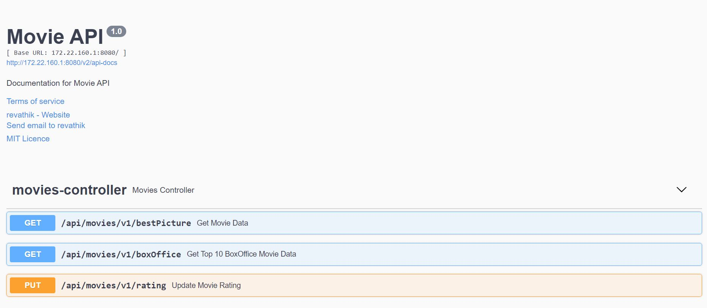
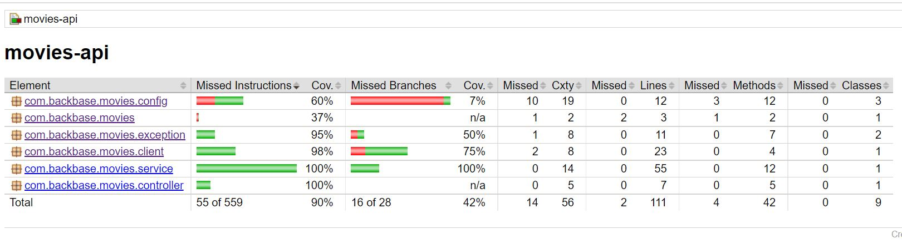

# Movies API

## Assignment Description
                ### =========================
                ### Movie API Specification
                ### =========================
1. The application should Indicate whether a movie won a “Best Picture” Oscar, given a
    movie’s title based on this API and the enclosed CSV file that contains winners from
    1927 until 2010.
2. It should also allow users to give a rating to movies and 
3. Provide a list of 10 top-rated movies ordered by box office value.

## Installation & Execution Steps

### Prerequisites

Java 11

Maven 3.6.0

Docker 19.03.8

### Dependencies

Spring boot 2.5.0 - Spring Framework

Swagger 2.8.0 - REST API Documentation (Swagger)

lombok 1.18.20 - Java Library

Jacoco Plugin 0.8.6 - Unit Test Coverage Plugin

## Execution

1. Checkout the source code

   https://github.com/revathiieee/movies-api

2. Build the Application (locally)
   
   ``` mvn clean install ```

3. Run the Application (locally)
   
   ``` mvn spring-boot:run ```

4. Build Test reports (locally)
   
   ``` mvn test verify ```

### Others

[how to test](https://github.com/revathiieee/movies-api/blob/main/how_to_test.md)

[how to run](https://github.com/revathiieee/movies-api/blob/main/how_to_run.md)

[solution](https://github.com/revathiieee/movies-api/blob/main/solution.md)

[assumptions](https://github.com/revathiieee/movies-api/blob/main/assumptions.md)

[to do](https://github.com/revathiieee/movies-api/blob/main/to_do.md)

## Screenshots

### Swagger



### Jacoco Coverage Report



## Author

### Revathi Kulandhaivelu

## Happy Coding!
   
