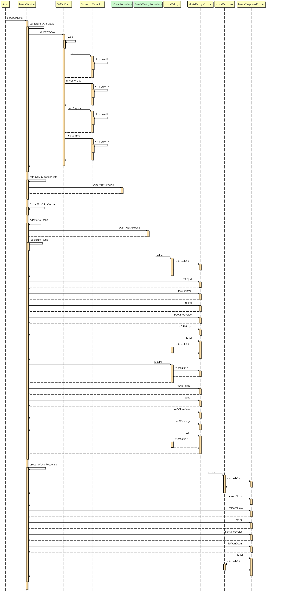
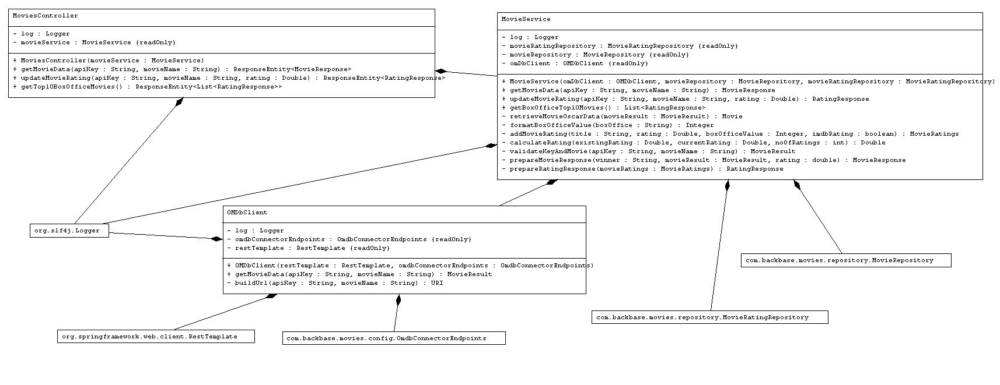
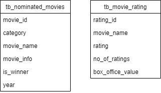

## Design

This Rest Api is designed with Java11 and spring boot.

1. '**Best Picture**' nominated and winner movies are feeded to mysql database in **tb_nominated_movies** (from the given excel file).
2. When User searches for a movie with apikey, 
    - Api key and Movie Name is validated by communicating with **omdb api**. 
3. If its not valid movie or invalid key, then MovieHttpException will be thrown along with Httpstatus and message. 
   It will be  handled in controller advice.
3. OMDB provides the data for the valid movie.
        - imdb rating and box office value is loaded into **tb_movie_ratings** table.
        - User given **rating** is also updated in tb_movie_ratings table.
        - Top10 **box office** movies are fetched from tb_movie_ratings table.

## Sequence Diagram

## Class Diagram

## Data Model Design

  
    
